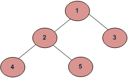

# Non linear data structures

## Tree

Binary tree 
- binary tree is a tree data structure in which each node has at most two children (0,1,2)

Binary Search Tree
- also called an ordered or sorted binary tree 

### Tree traverse (Tree Iteration)

- BFS - Breadth First Traversal (Or Level Order Traversal)
- DFS - Depth First Traversals
    - Inorder Traversal (Left-Root-Right)
    - Preorder Traversal (Root-Left-Right)
    - Postorder Traversal (Left-Right-Root)

The most important points is, **BFS starts visiting nodes from root** 
while **DFS starts visiting nodes from leaves**. 
So if our problem is to search something that is 
more likely to closer to root, we would prefer BFS. 
And if the target node is close to a leaf, we would prefer DFS.

Example:

Path:

- Breadth First Traversal : 1 2 3 4 5
- Depth First Traversals:
    -  Preorder Traversal : 1 2 4 5 3 
    -  Inorder Traversal  :  4 2 5 1 3 
    -  Postorder Traversal : 4 5 2 3 1

