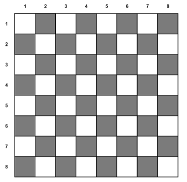
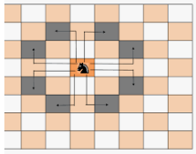

# Knight's tour 

## Definition

Board:



Goal: 
- Visit with one knight each cell on the board. => 64 cells / moves

Conditions:
- You can move only as Knight can move => **to the L**
- You cannot go outside of the board
- You cannot visit the same cell twice. 




## Definition - programming

1) Board = Matrix:

```JS
let board = [
        [0, 0, 0, 0, 0, 0, 0, 0],
        [0, 0, 0, 0, 0, 0, 0, 0],
        [0, 0, 0, 0, 0, 0, 0, 0],
        [0, 0, 0, 0, 0, 0, 0, 0],
        [0, 0, 0, 0, 0, 0, 0, 0],
        [0, 0, 0, 0, 0, 0, 0, 0],
        [0, 0, 0, 0, 0, 0, 0, 0],
        [0, 0, 0, 0, 0, 0, 0, 0],
    ]
```

2) Condition 1 - Knight moves

```Text
      0,0                   0,8

          (-1,-2) _ _ (1,-2)
        (-2,-1) _ _|_ _ (2,-1)
                   |
                   x
         (-2,1) _ _|_ _ (2,1)
           (-1,2) _|_ (1,2)
                
      8,0                   8,8
```

which is array of moves

```Js
const knightMoveOptionsList = [
        [-2, 1],
        [-2, -1],
        [-1, -2],
        [1, -2],
        [2, -1],
        [2, 1],
        [1, 2],
        [-1, 2],
    ];
```

3) Condition 2+3 

```JS
const isValidMove = (x, y, board) => {
        if (
            // - You cannot go outside of the board
            x >= 0 && x < 8 && y >= 0 && y < 8
            // - You cannot visit the same cell twice. 
            && board[x][y] === 0
        ) {
            return true;
        } else {
            return false;
        }
    }
```