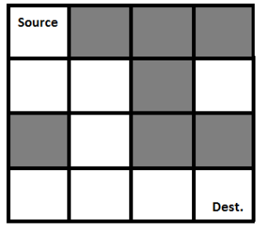

# Rat in the maze


## Definition

Board:




A Maze is given as N*N binary matrix of blocks where source block is the upper left most block i.e., maze[0][0] and destination block is lower rightmost block i.e., maze[N-1][N-1]. 

Goal:
- A rat starts from source and has to reach the destination.

Conditions:
- The rat can move only in 4 directions: **up, down, left, right**.
- The rat cannot go outside of the board
- The rat cannot go on cell where is wall


## Definition - programming

1) Board = Matrix:

```Js
let board = [
        [1, 0, 0, 0],
        [1, 1, 0, 1],
        [0, 1, 0, 0],
        [1, 1, 1, 1],
    ]
```

2) Condition 1 - The rat moves

```Text
      0,0                   0,4

                 (0,-1)
                   |
           (-1,0) -x- (1,0)
                   |
                 (0,1)
                
      4,0                   4,4
```

which is array of moves

```Js
const ratMoveOptionsList = [
        [0,1],
        [1,0],
        [0,-1],
        [-1,0],
    ];
```

2) Condition 2+3

```JS
const isValidMove = (x, y, board) => {
        if (
            // - The rat cannot go outside of the board
            x >= 0 && x < 4 && y >= 0 && y < 4
            // - The rat cannot go on cell where is wall
            && board[x][y] !== 0
        ) {
            return true;
        } else {
            return false;
        }
    }
```