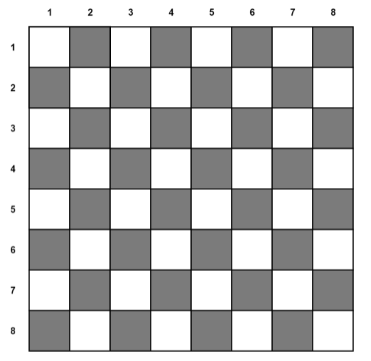
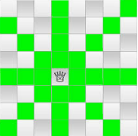

# N Queen Problem

## Definition

Board:



Goal: 
- The N Queen is the problem of placing N chess queens on an N×N chessboard so that no two queens attack each other.

Conditions:
- You can move only as queen can move: **vetically (+) and diagonally (x)**
- You cannot go outside of the board
- No two queens can attack each other




## Definition - programming

1) Board = Matrix:

```JS
let board = [
        [0, 0, 0, 0, 0, 0, 0, 0],
        [0, 0, 0, 0, 0, 0, 0, 0],
        [0, 0, 0, 0, 0, 0, 0, 0],
        [0, 0, 0, 0, 0, 0, 0, 0],
        [0, 0, 0, 0, 0, 0, 0, 0],
        [0, 0, 0, 0, 0, 0, 0, 0],
        [0, 0, 0, 0, 0, 0, 0, 0],
        [0, 0, 0, 0, 0, 0, 0, 0],
    ]
```
