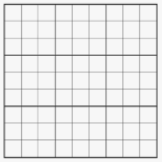
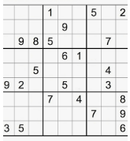
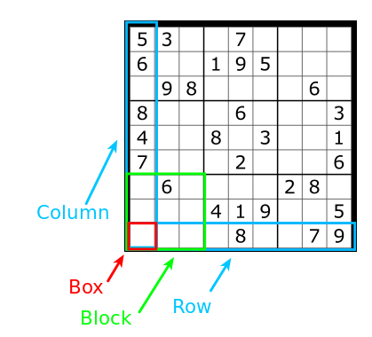

# Sudoku 


## Definition

Board:



Board start:

Some numbers will be predefined. we are not covering generating of the board.
- Easy - a lot of number is predefined.
- Hard - a few numbers are predefined.



Rules:

You are selecting numbers from 1 to 9. In each block, row and column cannot exist two same numbers.



**For this case number 1 can be write to the box.** </br>
Number 1 is not present in the current block. </br>
Number 1 is not present in the current row. </br>
Number 1 is not present in the current column. </br>

## Definition - programming

1) Matrix = Board

```Js
let board = [
    [0,0,0,0,0,0,0,0,0],
    [0,0,0,0,0,0,0,0,0],
    [0,0,0,0,0,0,0,0,0],
    [0,0,0,0,0,0,0,0,0],
    [0,0,0,0,0,0,0,0,0],
    [0,0,0,0,0,0,0,0,0],
    [0,0,0,0,0,0,0,0,0],
    [0,0,0,0,0,0,0,0,0],
    [0,0,0,0,0,0,0,0,0],
];
```

2) Condition 1 - board size


```JS
const isValid = (board, x, y, number) => {


    if(x >= 0 && x < 8 && y >= 0 && y < 8){


    };

    // check row
    for(let i=0; i<8; i++){
        
    }
}
``
